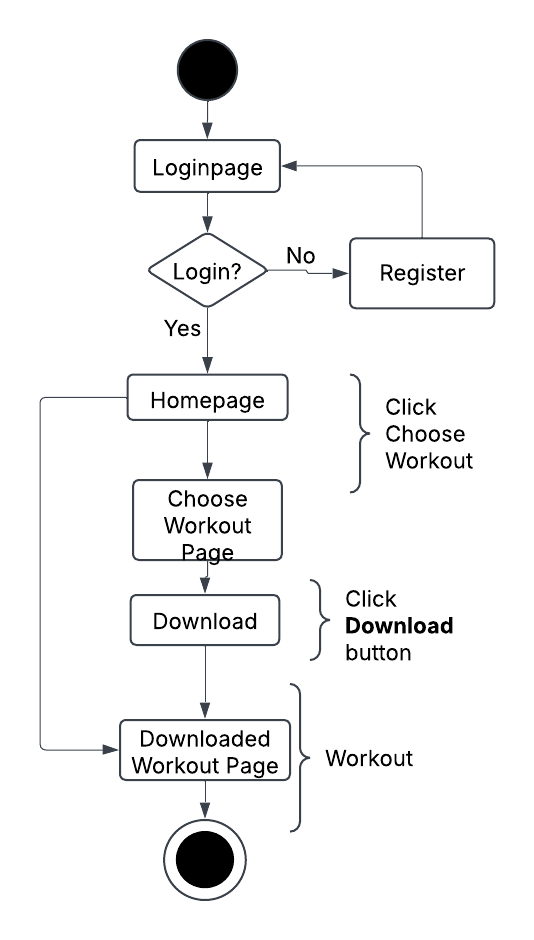

# Specification Phase Exercise

A little exercise to get started with the specification phase of the software development lifecycle. See the [instructions](instructions.md) for more detail.

## Team members

- Xiaowei Ma [GitHub](https://github.com/WillliamMa)
- Rishi Rana [GitHub](https://github.com/Rishi-Rana1)
- Mandy Mao [GitHub](https://github.com/manrongm)
- Tony Liu [Github](https://github.com/tony102809)

## Stakeholders

### Stakeholder Interview
**Stakeholder:** *Mark, 40, Busy Professor.*

#### Goals & Needs:
1. Find efficient workouts that fit into a demanding work schedule.
2. Reduce stress through structured fitness activities.
3. Improve overall health and energy levels.
4. Receive reminders to maintain workout consistency.

#### Problems & Frustrations:
1. Limited time to dedicate to workouts.
2. Difficulty in maintaining workout discipline.
3. Prefers structured plans rather than random exercises.
4. Needs flexibility to adjust workout times and plans.

**Stakeholder:** *David, 20, a NYU student live in Jersey.*

#### Goals & Needs:
1. Find short but effective workouts that fit into a tight academic schedule.
2. Access low-cost or free workout plans tailored to dorm living.
3. Improve stamina and fitness for extracurricular activities.
4. Maintain motivation through progress tracking and challenges.

#### Problems & Frustrations:
1. Lack of space and equipment for full gym workouts in spare time.
2. Difficulty in balancing academics and fitness routines.
3. Struggles with motivation and consistency.
4. Unsure which exercises are best for beginners.

## Product Vision Statement
## Product Vision Statement
**Gymer is a mobile fitness app that provides structured, time-efficient, and flexible workout solutions tailored to the busy schedules of professionals and students, enabling them to maintain consistency, reduce stress, and achieve their health goals through guided exercises, progress tracking, and smart reminders.**

## User Requirements

### User Stories

1. **As a busy professional,** I want to select a quick workout plan so that I can stay fit despite my tight schedule.  
2. **As a student,** I want to access low-cost workout plans that fit into my apartment living constraints so that I can exercise without needing a gym.  
3. **As a beginner,** I want step-by-step workout guidance so that I can perform exercises correctly and avoid injuries.  
4. **As a busy professional,** I want structured workout reminders so that I can stay accountable to my fitness goals.  
5. **As a student,** I want to have a community inside the app so that I can learn some exercising experience shared by others.  
6. **As a busy professional,** I want short stress-relief workout options so that I can manage my well-being despite my hectic workload.  
7. **As a beginner,** I want to have some video guide of standard actions so that I can avoid hurt myself.  
8. **As a beginner,** I want access to beginner-friendly exercise routines so that I can gradually increase my fitness level.  
9. **As a busy professional,** I want offline workout plan access so that I can exercise even when traveling.    
10. **As a busy professional,** I want the ability to customize my workout intensity so that I can adjust exercises to my fitness level. 
11. **As a beginner,** I want to set up a goal for lose weight so that I know the amount of exercise I need each week.
12. **As a busy professional,** I want to have a clean menu between each function so that I can quickly start workout, no wasting time.

## Activity Diagrams

1. **As a busy professional,** I want to select a quick workout plan so that I can stay fit despite my tight schedule.  

## Clickable Prototype

See instructions. Delete this line and place a publicly-accessible link to your clickable prototype here.
